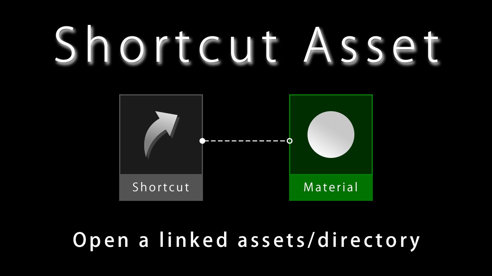

# Unreal Engine Plugin: Shortcut Asset

**Shortcut Asset** is an Unreal Engine plugin that adds asset to open a linked asset/directory.  
This works like a shortcut file in Windows/macOS or a symbolic link in Linux.

Unreal Engine supports the "Collections" and "Favorites" feature to open assets/directories with more accessibility.  
However, these features aggregate the access points, which does not allows you to manage assets flexibly.  
For example, the "Collections" feature can create the access point to the asset, but all access points are aggregated into the Collections category.
It also does not support directory access.  
The "Favourites" feature can create the access point to the directory, but all access points are aggregated to the Favourites category.
It also does not support asset access.  

Shortcut asset overcomes all these problems.

## Features

This plugin adds an asset named **Shortcut**.

The **Shortcut** asset supports the following features.

* Open an asset with a shortcut asset.

* Open a directory with a shortcut asset.

## Supported Environment

This plugin supports on the below environment.

* Unreal Engine Version: 4.27 / 5.0-5.6
* Development Platforms: Windows / macOS / Linux
* Target Build Platforms: All platform

## Installation

This plugin is distributed at [Fab](https://www.fab.com/ja/listings/32616e78-e6ef-4645-903b-22af25e2a1dd).  
You can buy and install it from there.

A free trial version is also available.  
See [the installation document](docs/installation.md) if you want to install the free trial version.  
The free trial version has the following limitation.

* The number of assets is limited to 3.

To get the benefit fully from this plugin, please consider purchasing this plugin at [Fab](https://www.fab.com/ja/listings/32616e78-e6ef-4645-903b-22af25e2a1dd).

## Tutorial

See [the tutorial document](docs/tutorial.md).

## Change Log

See [CHANGELOG.md](CHANGELOG.md)

## Bug Report / Feature Request / Disscussions

If you want to report problems or request features, please [make issues](https://github.com/colory-games/UEPlugin-ShortcutAsset/issues).  
You can also discuss about this plugin at [Discord (shortcut-asset channel)](https://discord.gg/UsreVyWVbM).

## Project Author

### Owner

This project is owned by the members of [Colory Games](https://colory-games.net/).  
The maintainer of this project is as follows.

|Name|Contact|
|---|---|
|[**@nutti**](https://github.com/nutti)|[Website (Japanese Only)](https://colorful-pico.net/) \| [Twitter](https://twitter.com/nutti__)|

### Contributor

* [**@BenVlodgi**](https://github.com/BenVlodgi)
