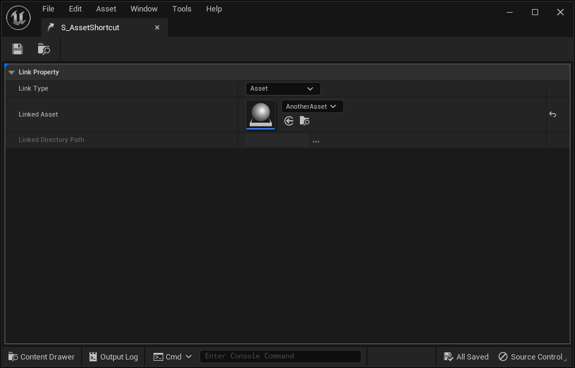
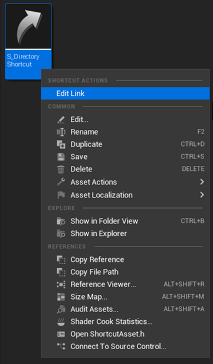
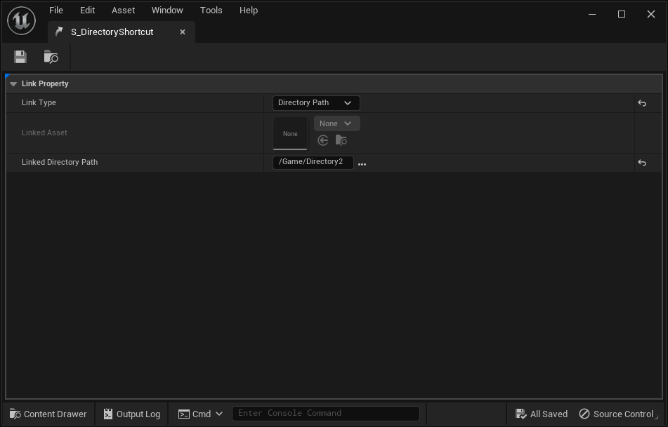

# Tutorial

* [Asset Shortcut](#asset-shortcut)
* [Directory Shortcut](#directory-shortcut)
* [Context Menu Access](#context-menu-access)

## Asset Shortcut

A **Shortcut** asset can be an access point to another asset.  
You can open another asset by double-clicking the **Shortcut** asset.

### Usage

1. Create a **Shortcut** asset.

   

2. Right-click on the **Shortcut** asset to open the context menu.
3. Click on the [Edit Link] menu to open an editor to edit the link.

   

4. Change the [Link Type] to [Asset].

   

5. Set [Linked Asset] another asset that you want to link to.
6. Save and close the editor.
7. Double-click the asset, and then you can see that a linked asset will be opened.

   

## Directory Shortcut

A **Shortcut** asset can be an access point to a directory.  
You can open a directory by opening the **Shortcut** asset.

### Usage

1. Create a **Shortcut** asset.

   

2. Right-click on the **Shortcut** asset to open the context menu.
3. Click on the [Edit Link] menu to open an editor to edit the link.

   

4. Change the [Link Type] to [Directory Path].

   

5. Set [Linked Directory Path] a directory that you want to link to.
6. Save and close the editor.
7. Double-click the asset, and then you can move to a linked directory.

  

## Context Menu Access

The plugin provides the context menu access to create the **Shortcut** asset.

### Create Shortcut for Selected Asset/Directory

You can directly create a new **Shortcut** asset from the context menu for the selected asset/directory.

### Create Shortcut from Clipboard

You can create a new **Shortcut** asset of a copied asset on the Clipboard.

